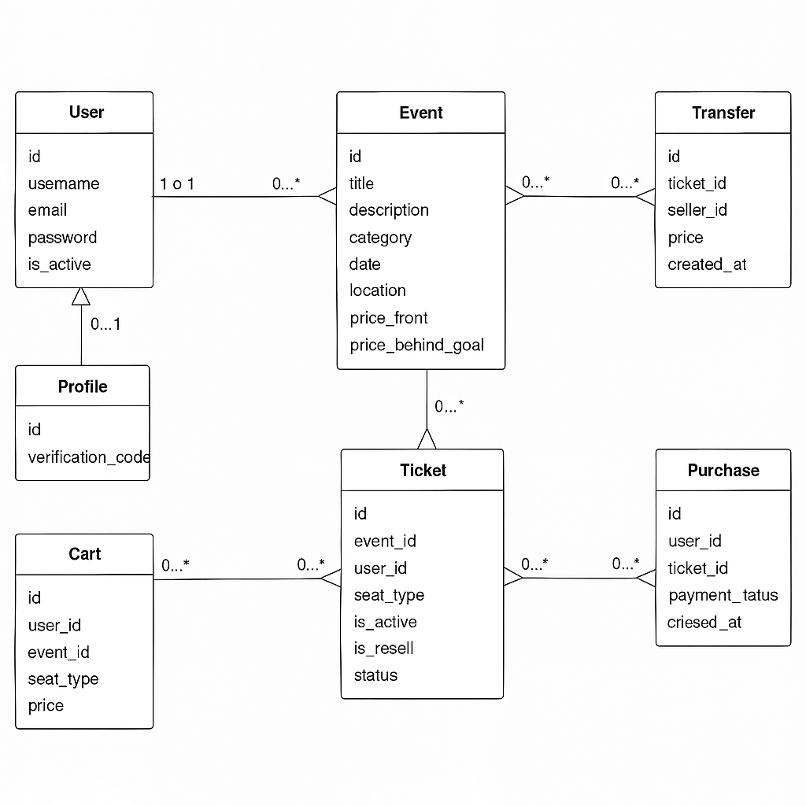

# TrueTix Backend

##  Project & Repository Description
TrueTix is a ticketing platform backend built with Django and Django REST Framework. It allows users to browse events, purchase tickets, resell them within the app to avoid the black market, and verify accounts via OTP. The system supports cart management, ticket resale, and admin control.

##  Tech Stack
- Python 3.11+
- Django
- Django REST Framework
- PostgreSQL
- Docker
- JWT Authentication
- SMTP (for email verification)
- Signals (for auto-creating user profiles)

##  Frontend Repository
[TrueTix Frontend (React)](https://github.com/Taif-Asiri/TrueTix_frontend)

##  ERD Diagram

## Routing Table

| Endpoint              | Method | Description                          |
|-----------------------|--------|--------------------------------------|
| `/api/register/`      | POST   | Register a new user                  |
| `/api/verify/`        | POST   | Verify account via OTP               |
| `/api/events/`        | GET    | List all events                      |
| `/api/tickets/`       | GET    | Get user's tickets                   |
| `/api/resell/`        | POST   | List a ticket for resale             |
| `/api/cart/`          | POST   | Add event to cart                    |
| `/api/cart/`          | GET    | View cart contents                   |
| `/api/checkout/`      | POST   | Complete ticket purchase             |

## IceBox Features
- Dedicated page for resale tickets
- QR code generation for purchased tickets
-  Event categories: Sports, Cultural, Entertainment, and more
-  Online payment integration
-  Notifications for new ticket availability
- Smart filtering by seat type and price

